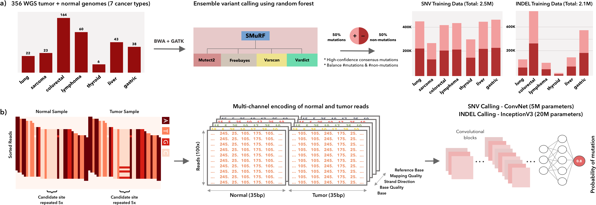

## VarNet: Accurate somatic variant detection using weakly supervised deep learning

VarNet is a pre-trained deep learning model trained on vast amounts of next generate sequencing data for accurate and robust detection of somatic variants across samples. It takes as input raw read information in the form of matched (tumor and normal) BAM files and outputs a VCF file containing somatic variants. 



## Publication
If you find VarNet useful for your work, please consider citing the paper.

Krishnamachari, K., Lu, D., Swift-Scott, A. et al. Accurate somatic variant detection using weakly supervised deep learning. Nat Commun 13, 4248 (2022). https://doi.org/10.1038/s41467-022-31765-8

<!-- ## Table of Contents
**[Requirements](#requirements)**<br/>
**[Docker Image](#docker-image)**<br/>
**[Example Usage](#example-usage)**<br/>
 -->

## Requirements
VarNet has been tested with python3.7, it may run without issues on other versions of python3. After downloading the latest release [here](https://github.com/skandlab/VarNet/releases), you can install the required libraries using the following command in the root of the repo:

```
pip install -r requirements.txt 
```

Alternatively, you can use the docker image with all requirements installed (details below).

**System Requirements:** Each process will use ~6GB of memory while running filter.py, and ~10GB while running predict.py. Please modify the --processes argument according to your memory and CPU availability. Whole genome filtering may take up 10-12 hours of **CPU** time, and whole genome prediction may take up to 150 hours of **CPU** time.

## Docker Image
You can download the docker image from docker hub using the following command:

```
docker pull kiranchari/varnet:latest
```

What's inside the Docker image?
-> Ubuntu 16.04 / python 3.7 + all requirements installed. 

Example Docker Usage:

```
docker run -it --rm -v /data:/pikachu -w /varnet kiranchari/varnet:latest python filter.py \
--sample_name dream1 \
--normal_bam /pikachu/dream1_normal.bam \
--tumor_bam /pikachu/dream1_tumor.bam \
--processes 2 \
--output_dir /pikachu/varnet \
--reference /pikachu/GRCh37.fa \
--region_bed /pikachu/region.bed (optional)
```
Please replace the path to the host data directory, i.e. /data, with your data path. The docker image has also been tested with Singularity (https://singularity.lbl.gov/). For e.g. run "singularity pull varnet.sif docker://kiranchari/varnet:latest" to save as a Singularity image. 

You may follow the example usage below for further details on running VarNet.

## Example Usage

Please make sure all .bam/.fa files are indexed and their respective indices are present in the same directory. Varnet was tested with BAM files that were aligned using BWA. Duplicate reads were marked and removed. We recommend the same preprocessing before running Varnet. Varnet does not perform realignment around INDELs so we recommend using GATK3 before running variant calling. 

VarNet will save all output to its output directory **output\_dir**. **sample\_name** is the name of the sample being run and must be consistent when running filter.py and predict.py   

If **region\_bed** is not provided, VarNet will scan all regions in the provided **reference** file. 

By default, VarNet will scan for both SNV and INDEL candidates. To scan for only SNV or INDEL candidates, use the **-snv** and **-indel**, respectively. If you choose to use this flag, please use it for both filtering as well as prediction.

1. Filter step to find candidates across genome
```
python filter.py \
    --sample_name dream1 \
    --normal_bam dream1_normal.bam \
    --tumor_bam dream1_tumor.bam \
    --processes 2 \
    --output_dir varnet_outputs \
    --reference GRCh38.fa \
    --region_bed region.bed (optional)
    -snv (optional flag, for snv filtering only)
    -indel (optional flag, for indel filtering only)
```
2. Make predictions and create VCF output (CPU mode)
```
python predict.py \
	--sample_name dream1 \
	--normal_bam dream1_normal.bam \
	--tumor_bam dream1_tumor.bam \
	--processes 2 \
	--output_dir varnet_outputs \
	--reference GRCh38.fa \
	-snv (optional flag, for snv calling only)
	-indel (optional flag, for indel calling only)
```

In this example the VarNet output VCF file will be saved to `varnet_outputs/dream1/dream1.vcf`.

# License

Shield: [![CC BY-NC-SA 4.0][cc-by-nc-sa-shield]][cc-by-nc-sa]

This work is licensed under a
[Creative Commons Attribution-NonCommercial-ShareAlike 4.0 International License][cc-by-nc-sa].

[![CC BY-NC-SA 4.0][cc-by-nc-sa-image]][cc-by-nc-sa]

[cc-by-nc-sa]: http://creativecommons.org/licenses/by-nc-sa/4.0/
[cc-by-nc-sa-image]: https://licensebuttons.net/l/by-nc-sa/4.0/88x31.png
[cc-by-nc-sa-shield]: https://img.shields.io/badge/License-CC%20BY--NC--SA%204.0-lightgrey.svg
