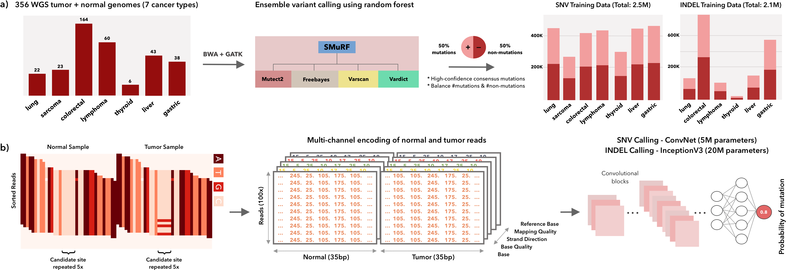

## VarNet: Accurate somatic variant detection using weakly supervised deep learning

VarNet is a pre-trained deep learning model trained on vast amounts of next generate sequencing data for accurate and robust detection of somatic variants across samples. It takes as input raw read information in the form of matched (tumor and normal) BAM files and outputs a VCF file containing somatic variants. 



## Publications

If you use VarNet in your work, please cite this paper:

> Krishnamachari, K., Lu, D., Swift-Scott, A. et al. Accurate somatic variant detection using weakly supervised deep learning. *Nat Commun* **13**, 4248 (2022). https://doi.org/10.1038/s41467-022-31765-8

```bibtex
@article{krishnamachari2022varnet,
  author  = {Krishnamachari, K. and Lu, D. and Swift-Scott, A. et al.},
  title   = {Accurate somatic variant detection using weakly supervised deep learning},
  journal = {Nature Communications},
  volume  = {13},
  pages   = {4248},
  year    = {2022},
  doi     = {10.1038/s41467-022-31765-8}
}
```

Please also cite the VarNet-T paper if you use the tumor-only model:

> Krishnamachari, K., Bui Nguyen, H.A., Kadioglu, S. et al. Improved tumor-only variant calling and mutation burden estimation with VarNet-T. *Nat Commun* (2026). https://doi.org/10.1038/s41467-026-71705-4

```bibtex
@article{krishnamachari2026varnett,
  author  = {Krishnamachari, K. and {Bui Nguyen}, H.A. and Kadioglu, S. et al.},
  title   = {Improved tumor-only variant calling and mutation burden estimation with {VarNet-T}},
  journal = {Nature Communications},
  year    = {2026},
  doi     = {10.1038/s41467-026-71705-4}
}
```

## Requirements
VarNet has been tested with python3.7, it may run without issues on other versions of python3. After downloading the latest release [here](https://github.com/skandlab/VarNet/releases), you can install the required libraries using the following command in the root of the repo:

```
pip install -r requirements.txt 
```

Alternatively, you can use the docker image with all requirements installed (details below).

**System Requirements:** Each process will use ~6GB of memory while running filter.py, and ~10GB while running predict.py. Please modify the --processes arguments according to your memory and CPU availability.

## Docker Image
You can download the docker image from docker hub using the following command:

```
docker pull kiranchari/varnet:latest
```

What's inside the Docker image?
-> Ubuntu 16.04 / python 3.7 + all requirements installed. 

Example Docker Usage:

```
docker run -it --rm -v /data:/pikachu -w /VarNet kiranchari/varnet:latest /bin/bash -c "git pull; python filter.py \
--sample_name dream1 \
--normal_bam /pikachu/dream1_normal.bam \
--tumor_bam /pikachu/dream1_tumor.bam \
--processes 2 \
--output_dir /pikachu/varnet \
--reference /pikachu/GRCh37.fa \
--region_bed /pikachu/region.bed (optional)"
```
Please replace the path to the host data directory, i.e. /data, with your data path. The docker image has also been tested with Singularity (https://singularity.lbl.gov/). For e.g. run "singularity pull varnet.sif docker://kiranchari/varnet:latest" to save as a Singularity image. 

You may follow the example usage below for further details on running VarNet.

## Example Usage

Please make sure all .bam/.fa files are indexed and their respective indices are present in the same directory. VarNet was tested with BAM files that were aligned using BWA. Duplicate reads were marked and removed. We recommend the same preprocessing before running Varnet. VarNet does not perform realignment around INDELs so we recommend using GATK3 before running variant calling. 

VarNet will save all output to its output directory **output\_dir**. **sample\_name** is the name of the sample being run and must be consistent when running filter.py and predict.py   

📝 **Note: VarNet can resume jobs that were stopped or interrupted. If you re-run the script with the same input and output directory, VarNet will automatically detect intermediate output files and pick up where it left off, so there is no need to delete outputs from a previous run.**

If **region\_bed** is not provided, VarNet will scan all regions in the provided **reference** genome file. 

By default, VarNet will scan and predict both SNV and INDELs. To scan and predict only SNV or only INDELs, use the **-snv** and **-indel** flags, respectively. If you choose to use this flag, please use it during both filtering as well as prediction.

1. Filter step to find candidates across genome
```
python filter.py \
    --sample_name dream1 \
    --normal_bam dream1_normal.bam (optional, omit for tumor-only mode) \
    --tumor_bam dream1_tumor.bam \
    --processes 2 \
    --output_dir varnet_outputs \
    --reference GRCh38.fa \
    --region_bed region.bed (optional) \
    --whitelist_vcf whitelist.vcf (optional, use only in tumor-only mode) \
    -snv (optional flag, for snv filtering only) \
    -indel (optional flag, for indel filtering only)
```
2. Make predictions and create VCF output
```
python predict.py \
	--sample_name dream1 \
	--normal_bam dream1_normal.bam (optional, omit for tumor-only mode) \
	--tumor_bam dream1_tumor.bam \
	--processes 2 \
	--output_dir varnet_outputs \
	--reference GRCh38.fa \
	--batch_size 64 (optional, default 64) \
	-snv (optional flag, for snv calling only) \
	-indel (optional flag, for indel calling only)
```

In this example the VarNet output VCF file will be saved to `varnet_outputs/dream1/dream1.vcf`.

## NEW Tumor-only mode

VarNet now supports a **tumor-only mode** for somatic variant detection, which uses the VarNet-T tumor-only models. **The docker image is required to run tumor-only mode.**

To run VarNet-T, simply omit the `--normal_bam` argument to run the analysis on a single tumor BAM file without a matched normal control. All commands otherwise remain the same.

This function must be run using the provided latest docker image above. Germline filtering using gnomAD and dbSNP databases (included in our docker image) will be automatically performed, in addition to a panel of normals filter. 

📝 **Note: Tumor-only mode currently only supports the hg38 reference genome, as the gnomAD, dbSNP, and panel of normals filters are based on hg38.**

In tumor-only mode, filter.py supports an optional **--whitelist\_vcf** argument that can be used to include any known germline oncogenic variants that may otherwise be filtered due to their presence in gnomAD or dbSNP.

## VarNet Benchmarking Guidance
We recommend including all variant calls from VarNet's VCF output, not just those marked "PASS," when creating precision-recall curves. The "PASS" designation was determined by a score threshold of 0.5, but using all calls provides a more complete picture of the model's performance across all possible thresholds.

# License

Shield: [][polyform-nc]

This work is licensed under the [PolyForm Noncommercial License 1.0.0][polyform-nc].

[][polyform-nc]

[polyform-nc]: https://polyformproject.org/licenses/noncommercial/1.0.0/
